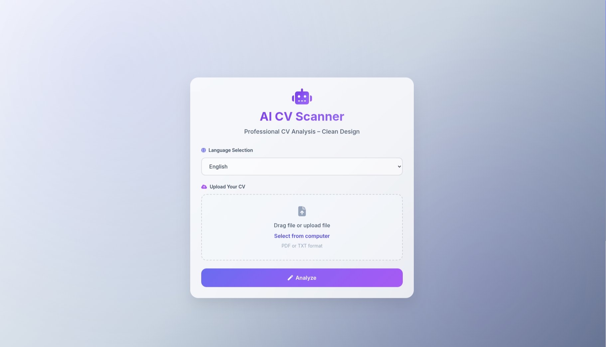
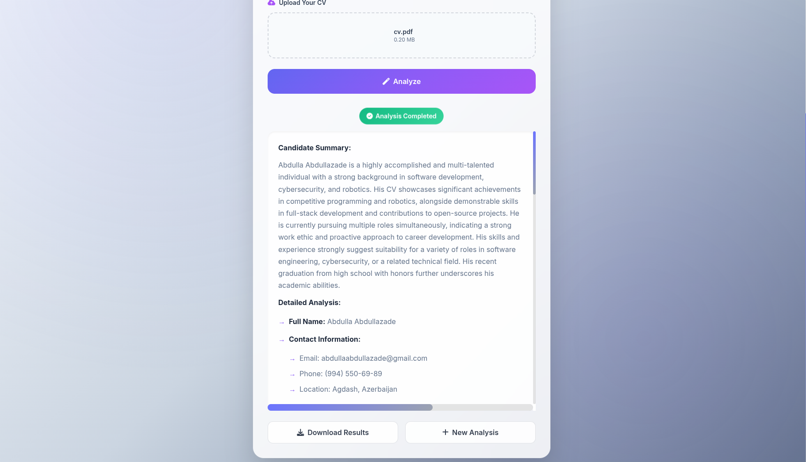

# 📄 AI CV Scanner

🚀 An AI-powered CV analyzer.  
This project uses the **Gemini API** to read, analyze, and extract useful insights from CVs.

---

## 🛠️ Technologies

- 🐍 Python 3.8+  
- ⚙️ Flask (backend)  
- 🤖 Gemini API (AI engine)  
- 📦 pip (package manager)  

---

## 📸 Screenshots

<p align="center">
  
  
</p>

---

## ⚡ Setup

1️⃣ **Clone the repository:**

```bash
git clone https://github.com/abdullaabdullazade/aicvscanner
cd aicvscanner
````

2️⃣ **Install dependencies:**

```bash
pip install -r requirements.txt
```

3️⃣ **Create a `.env` file** in the project root and add your Gemini API key:

```env
API_KEY=your_api_key_here
```

> 🔑 You can get your API key from your [Gemini account](https://aistudio.google.com/api-keys).

---

## ▶️ Run the Project

```bash
python main.py
```

Then open your browser and navigate to:

👉 [http://localhost:5000](http://localhost:5000)

---

## 📂 Usage

* Make sure your API key is correctly set in the `.env` file.
* After running `main.py`, the app will be available at **localhost:5000**.
* Upload CVs and analyze them with the **AI CV Scanner**.

---

## ⭐ Support the Project

If you find this project helpful, consider giving it a ⭐ on GitHub!
